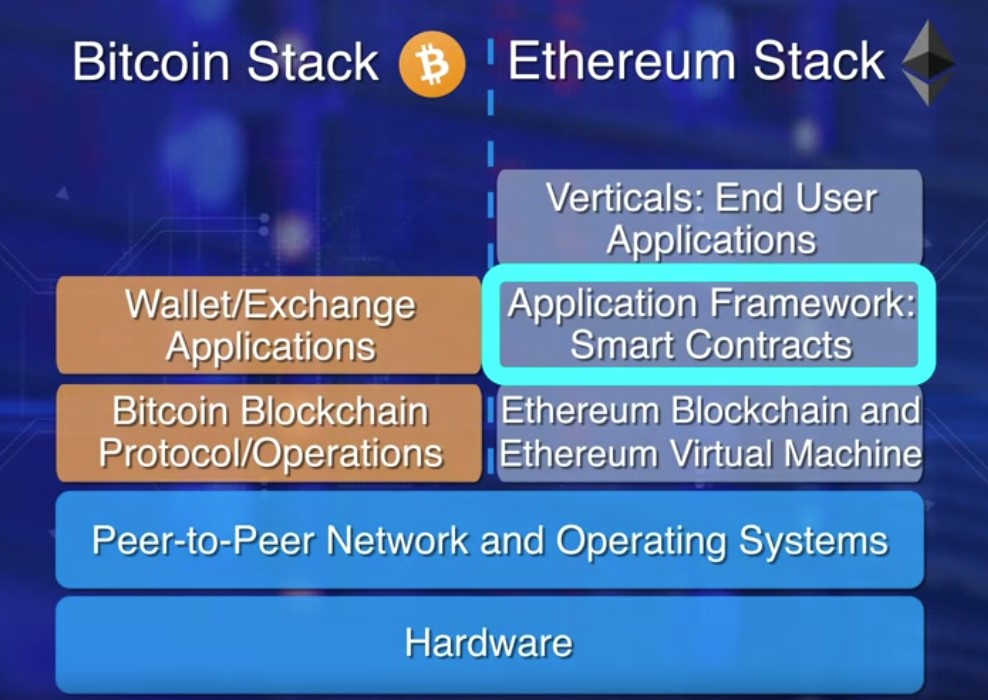
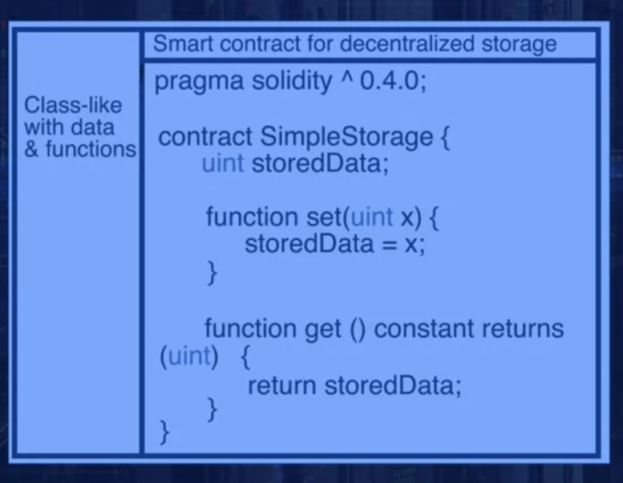

# Blockchain Tutorials

## What is a blockchain
It enables peer to peer transactions of digital assets, it was popular because of the popular cryptocurrency Bitcoin, Blockchain is itself grown a big in past years in many industries.
*   Peer to peer transactions in a Decentralized network.
*   Establishing trust among unknown peers.
*   Recording transactions in a Distributed Digital Ledger

### Blockchain Applications
*   Finance
*   Healthcare
*   Manufacturing
*   Distribution

The blockchain can transform a lot big applications, like 
*   Goods Transfer (Supply Chain)
*   Digital Media Transfer (Sale of Art)
*   Remote Services Delivery (Travel and Tourism)
*   Decentralized Business Logic (Move Computing to Data Sources)
*   Distributed Intelligence (Education Credentialing)
*   Distributed Resources (Power Generation and Distribution)
*   Crowd Funding (Startup Fund Raising)
*   Crowd Operation (Electronic Voting)
*   Identity Management (One ID for all your life's functions)
*    Goverment Public Records (Open Governing)

### Learning Objectives
*   Explain three fundamental characterstics that define a blockchain.
*   Explain the important features of Ethereum blockchain.
*   Explain algorithms and techniques that enable a blockchain.
*   Outline methods for realizing trust in a Blockchain.

## Introduction of Bitcoin
*   Its a Digital Currency System
*   Its totally an Autonomous Decentralized Application
*   A mysterious person Satoshi Nakamoto build an Decentrailized Currency called Bitcoin.
*   Bitcoin enabled an innovative platform of peer to peer transfer of currencies without any centralized Authority.
*   There is no central authority, as such Validity Verification and Consensus the infrastructure behind all of them is Blockchain.

### Centralized vs Decentralized Network
*   Consider a Scenerio where A wants to send money to B with his credit card, therefore in a Centralized Network the intermediatories are.
    *   A the sender
    *   Credit Card Agency (MasterCard or Visa)
    *   Customer Bank (Bank of India)
    *   Credit Cards Bank
    *   Exchange
    *   Merchents Bank
    *   B the Merchent
*   In a Decentralized network there are peers who act as intermediatory in the process, peers are not necessarily known to each other. 
*   Record the transactions in a Distributed Ledger of blocks, Encrypt the transaction with encryption. 
*   To Establish Trust Peers need to Validate, Verify and Confirm the transactions by adding them in the blockchain via consenses protocol and this all is managed by the blockchain itself.

### Blockchain Structure
*   Transactions is the basic element of the Blockchain
*   Transactions are validated and broadcasted to the Distributed Digital Ledger to all peers.
*   When Transactions are approved then it becomes a block
*   Many blocks connecting to each other makes a blockchain, blocks use a Consensus and Verify protocol to check the integrity of the blockchain by verifying the signature of previous block and the next block.
*   Validation and Consensus protocol are carried out by special peer nodes called miners.
*   These miners are the powerfull computers executing the problem software provided by the blockchain protocol.

## UTXO
* A fundamental concept of a bitcoin is **Unspent Transaction Output (UTXO)**.
*   UTXO defines the state of the blockchain.
*   UTXO are referred as the inputs in the transaction and the outputs generated by the transaction.
*   All of the UTXO in the system are stored in the participant Nodes in thier Database.

Bitcoin Blockchain UTXO
*   The transaction uses the amount specified by one or more UTXO's and transmit it to one or more newly created output UTXOs, According to the request initiated by the sender.
*   The structure of a UTXO
    *   It includes a unique identifier of the transaction that created the UTXO.
    *   An index or the position of the UTXO's in the transaction output list.
    *   A value or the amount the transaction is for.
    *   And an Optional Script can be spent.
*   Transaction Includes
    *   Reference Number of the current transaction.
    *   Reference to one or more input UTXOs
    *   Reference to one or more output UTXO's newly generated by the current transaction.
    *   Total input amount and output amount.

Transaction Summary
*   In a transaction we have a transaction number
*   3 Input UTXO's as reference
*   And two output UTXO's as reference.
*   The concept of UTXO defines the inputs and outputs of such a transaction.
*   Once block have been verified by algorithmically adding up by the miners the block is added to the chain of blocks, namely the Blockchain.

Genesis Block
*   It is the 1st block in the Blockchain where the blockchain introduces the total number of Cryptocurrencies.
*   Since there is no previous block therefore the genesis block previous hash containing all zeros to specify that this is the 1st block ever created in the blockchain.

## Basic Operations
*   Operations in a Decentralized network is the responsibility of the peer participants and thier respective computational nodes (Laptop Desktop Servers etc)
*   Validation of Transactions
*   Gathering transactions for a block
*   Broadcasting valid transactions & blocks
*   Consensus on next block creation.
*   Chaning blocks to become an immutable record in blockchain.

## Participants
*   Two major roles of participants
*   Participants that initate transfer of value by creating a transaction.
*   Additional participants are called miners who pick on added work or computation to verify transactions, broadcast transactions. 
*   Miners task during the process
    *   Verify transactions
    *   Broadcast Transactions
    *   Compete to create a block
    *   Reach consensus by validating block
    *   Broadcasting newly created block
    *   Confirming Transactions
*   Participants for mining do this work because when one block is verified and added to the chain miners get reward as currency in thier wallets.
*   Transactions validation is carried out independently by all the miners.
*   The process of mining involves validation of more then 20 criteria, including size, syntax, etc.
*   Some criteria are input UTXO, output UTXO.
    *   Referenced input amount and output amount matched sufficiently.
*   Invalid transactions are rejected and will not be broadcasted.
*   All the valid transactions are added to a pool of transactions.
*    Miners select a set of transactions from this pool to create a block.
*   Miners compete to solve a puzzle to determine who earn the right to create the next block.
*   In case of Bitcoin Blockchain this puzzle is a computational puzzle uses CPU to solve this problem.
*   Once a miner solves a puzzle the announcement is broadcasted to the network and the block is also broadcasted to the network.
*   Then other participants verify the new block, participants reach a consensus to add a new block to the chain, this new block is added to thier local copy of the blockchain.
*   Thus a new set of transactions are recorded and confirmed.
*   The algorithm for consensus is called proof of work protocol since it involves work and computational power of the miners.

   

*   Transaction Zero, index zero of the confirmed block is created by the miner of the block.
*   It has a special UTXO and does not have any input UTXO, it is called the coinbase transaction that generated the miners fees for the block creation.
*   Currently the miners fees is 12.5 BTC for a bitcoin.
*   This is how new coin is maintained in bitcoin.

## Beyond Bitcoin
*  Bitcoin blockchain is open sourced and the entire code is available on Github.
* During the initial year of 2009 this code became the reason of launching more then 300 Cryptocurrencies in the market.
* Bitcoin supports special feature called as Scripts for Conditional transfer of values
* Ethereum Blockchain extended the scripting feature into a full blown code execution framwork called smart contract.

### Smart Contracts
* A smart contract orivude the very powerful capability of code execution for embadding business logic on the blockchain.

### Types of Blockchain
* Type 1 Only Cryptocurrency deals with the currency and the currency chain specially designed for the currency trade and mining.
* Type 2 Supports Cryptocurrency and a Business logic layer supported by code execution example ethereum.
* Type 3 Only Business logic no cryptocurrency example The Linux Foundation HyperLedger.
 
### Blockchain Categories
*   **Public** Bitcoin Blockchain is publically avaialable and anyone in the Blockchain can add new blocks in the blockchain, thus bitcoin is an example of Public Blockchain Class.
* Transaction blocks and participants all are open sources you can also create new coin digital currency by modifying the bitcoin code.
* **Private** Access to the blockchain is limited to a specific group of people for example
* Those participant within an organization This restricttion helps in simplifying the normal operations such as block creation  and contingence model.
* **Permissioned** Blockchain also called consortium blockchain, It is meant for the consortium and collaboration parties to transact on a blockchain for ease of governance, proverance, and accountability.
*   For example a Consortium of all Automobile companies and healthcare organizations.
* It have the benifits of the public blockchain with allowing only users with permission to collaborate and transact.

#### Summary
* Significant innovations such as smart contract have opened up broader applications of Blockchain technology.
* It allows private and permissioned blockchain allow for controlled access to the blockcahin enabling many diverse business models.

# Ethereum Blockchain
* Bitcoin blockchain is the mother of all blockchains. 
* It was intended for peer to peer transfer of value and it does that well. Around 2013, a framework for code execution was introduced by Ethereum Founders. The centerpiece and thrust of this Ethereum blockchain is a smart contract. 

* Consider this togged diagram comparing Bitcoin and Ethereum blockchain. 
*   On the left is the Bitcoin blockchain and a wallet application for initiating transactions. 
*   On the right is Ethereum that took a significant step towards transforming the blockchain into a computational framework that opened up a whole world of opportunities in the decentralized realm. 

### Learning Objectives
*   high level the innovation of the ethereum blockchain, namely the smart contract. 
*   Illustrate ethereum blockchain protocol, 
*   Structural elements, and operational aspects. 
*   Demonstrate the concept of gas, the fuel or the payment model for code execution and the incentive model for the Ethereum blockchain.

## Smart Contracts
*   Ethereum supports smart contracts and of virtual machine on which smart contracts execute. 
*   Smart contracts in turn enable decentralized application that accomplish more than a transfer of value. 
*   Efficient automation of decentralized application such as supply chain. 
*   A smart contract is a piece of code deployed in the blockchain node. 
*   Execution of a smart contract is initiated by a message embedded in the transaction. 
*   Digital currency transfer request simple addition and subtraction. 
*   Ethereum enables transaction that may carry out more sophisticated operations. 
    *   For example, a transaction could require a conditional transfer, 
    *   it may require some evaluation, 
    *   it may need more than one signature for transfer of assets, or it may involve waiting for a specific time or date. 
*   Example
    *   An auction bidding smart contract could execute this logic. 
    *   If the age of a bidder is greater than 18 and the bid is greater than the minimum bid, then, accept the bid, or else reject the bid. 
    *   This can be done by a smart contract. 
### What does the smart contract look like? How do you write a smart contract? 
*   Structurally, a smart contract resembles a class definition in an object oriented design. 
*   It has data, functions or methods with modifiers public or private, along with getter and set of functions. 
*   Specific programming languages have been designed for coding smart contracts. Solidity is one such language. 

*   Let's examine a simple Solidity smart contract to understand its structure. 
*   First line with pragma indicates the version of the solidity language. 
*   The contract's name is in the first line. 
*   This particular contract is for one integer storage. 
*   The data for the integer is defined with type a name, uint StoredData. 
*   Two functions are defined for writing and reading the data. Set and get. 
### Code execution. 
*   Where does the code in the smart contract get executed? Where is it located in a node? We need a computational infrastructure to execute any arbitrary code. 
*   Every node in Ethereum network should be able to execute the code irrespective of that underlying type of hardware or operating system. Enter Ethereum Virtual Machine, EVM. 
*   An EVM provides a run anywhere obstruction layer for the contract code. 
*   A smart contract written a high level programming language is translated into EVM byte code, and then, deployed on the Ethereum Virtual Machine, EVM. 
*   Every node will host the same smart contract codes on the EVM. 
### Summary
*   Smart contracts add a layer of logic and computation to the trust infrastructure supported by the blockchain. Smart contracts allow for execution of code. 
*    Enhancing the basic value transfer capability of the Bitcoin blockchain. 
*   The code for this smart contract is written in a high level language like Solidity and compiled into byte code. 
*   The code for the smart contracts is executed on a special structure known as Ethereum Virtual Machine.

